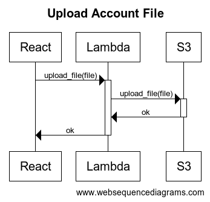
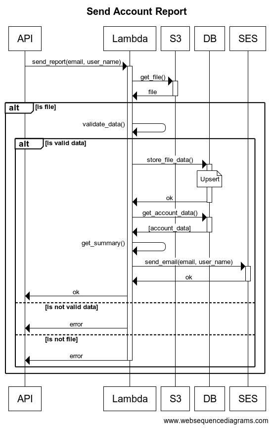
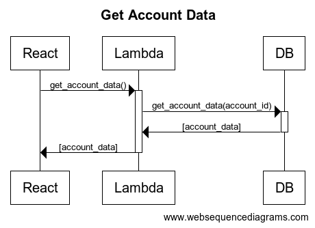

# Accounts Report Challenge

Challenge that sends a report of the summary of an account, fed by a CSV.

- You can access the front end to upload files and view the database at the following [link](https://staging.d3dh9dnlcu97xg.amplifyapp.com). You can use the test files stored in this repo in the `assets` folder.

- You can send the email with the summary of transactions by making a `POST` request to the following API `https://373at1pkac.execute-api.us-east-1.amazonaws.com/dev/reports` with a body like the following:

> [!IMPORTANT]
> This API is down. If you want to set up your own API, follow the steps in the back section.
> [API Gateway Definition](/back/README.md#api-gateway-definition)

```bash
{
    "email": "<your email>",
    "user_name": "<your name>"
}
```

## Table of Contents

1. [Features](#features)
2. [Technologic Stack](#technologic-stack)
3. [Author](#author)
4. [License](#license)

## Features

The project consists of two parts:

- An application stored in the `front/upload-files` folder created in ReactJs and deployed on Amplify, which serves as an interface to upload a CSV file to S3 using the Uppy library, as well as a simple table that displays records from the DynamoDB database.

- A backend stored in the `back` folder with three APIs:

  - An auxiliary API to upload files to S3, required by Uppy.
  - An API to read the file from S3, obtain and validate the data, store new records in DynamoDB, perform calculations, and send the summary by email.
  - An API to retrieve the records from the database.







## Technologic Stack

A list of technologies used within the project:

- [ReactJS](https://react.dev): Version 18.3.1
- [Python](https://www.python.org): Version 3.8.19
- [S3](https://aws.amazon.com/en/s3)
- [AWS Lambda](https://aws.amazon.com/en/pm/lambda/)
- [API Gateway](https://aws.amazon.com/en/api-gateway/)
- [AWS DynamoDB](https://aws.amazon.com/en/dynamodb/)
- [Amplify](https://aws.amazon.com/en/pm/amplify/)

## Author

Made by Eduardo Giles


## License

This project is available for use under the MIT License.
