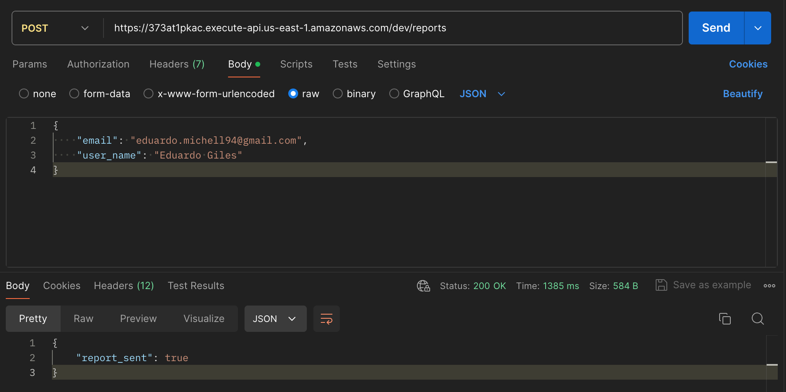
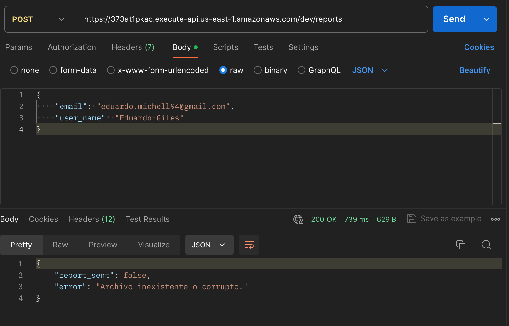

# Send Email And APIs

The project contains three APIs:

- An auxiliary API to upload files to S3, required by Uppy.
- An API to read the file from S3, obtain and validate the data, store new records in DynamoDB, perform calculations, and send the summary by email.
- An API to retrieve the records from the database.





## Table of Contents

1. [Technologic Stack](#technologic-stack)
2. [API Endpoints](#api-endpoints)
3. [API Gateway Definition](#api-gateway-definition)
4. [DynamoDB Definition](#dynamodb-definition)
5. [Instalation And Run In Local](#instalation-and-run-in-local)
6. [Testing](#testing)
7. [Deploy To Lambda](#deploy-to-lambda)
8. [Author](#author)
9. [License](#license)

## Technologic Stack

A list of technologies used within the project:

- [Python](https://www.python.org): Version 3.8
- [Miniconda](https://docs.anaconda.com/miniconda/): Version 24.1.2
- [S3](https://aws.amazon.com/en/s3)
- [AWS Lambda](https://aws.amazon.com/en/pm/lambda/)
- [API Gateway](https://aws.amazon.com/en/api-gateway/)
- [AWS DynamoDB](https://aws.amazon.com/en/dynamodb/)

## API Endpoints

The URL for the APIs is `https://373at1pkac.execute-api.us-east-1.amazonaws.com/dev`

> [!IMPORTANT]
> This API is down. If you want to set up your own API, follow the steps in the next section.
> [API Gateway Definition](#api-gateway-definition)

| HTTP Verbs | Endpoints                                   | Action                             |
| ---------- | ------------------------------------------- | ---------------------------------- |
| GET        | /accounts                                   | To fetch all records from DynamoDB |
| POST       | /files/s3/multipart                         | Required by Uppy                   |
| GET        | /files/s3/multipart/{uploadId}/{partNumber} | Required by Uppy                   |
| POST       | /files/s3/multipart/{uploadId}/complete     | Required by Uppy                   |
| GET        | /files/s3/params                            | Required by Uppy                   |
| POST       | /reports                                    | To send summary email              |

## API Gateway Definition

You can find the OpenAPI definition JSON to import to your API Gateway in this repo, in the `assets` folder.

- Change `<region>` and `<account_id>` in the file with your region and your account id.

## DynamoDB Definition

- Partition key: `account_id (N)`
- Sort key: `id (N)`

## Instalation And Run In Local

- Install miniconda

- Create a new environment

```bash
conda create --name env_name python=3.8
```

- Activate environment

```bash
conda activate env_name
```

- Install requirements.txt

```bash
conda install --file requirements.txt
```

- Run any function in `aws_lambda_wrapper.py` file. Each function has its own docstring that shows an example of how to execute the function.

```bash
python aws_lambda_wrapper.py '{<inbound>}' --function <function_name>
```

## Testing

Run the pytest command. Verify in the `config.ini` file that the mock variable is set to `yes` to avoid unnecessary calls to other resources like S3 and DynamoDB.

```bash
pytest test
```

## Deploy To Lambda

- Zip all the content in `back` folder

- Update the zip file for the desired lambda function

## Author

Made by Eduardo Giles


## License

This project is available for use under the MIT License.
