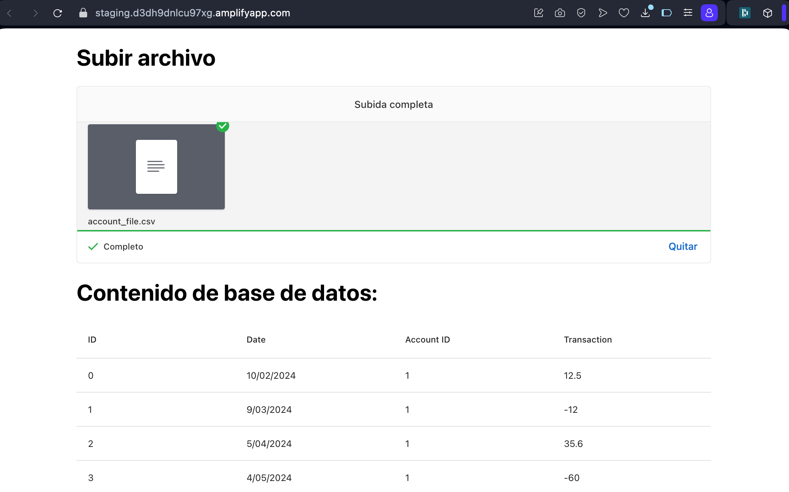

# Upload Files And View Db Records

Front end to upload CSV files to S3 and visualize database data. You can access the front end through the following [link](https://staging.d3dh9dnlcu97xg.amplifyapp.com) and use the files stored in `root/assets`."



## Table of Contents

1. [Technologic Stack](#technologic-stack)
2. [Instalation In Local](#instalation-in-local)
3. [Deploy To Amplify](#deploy-to-amplify)
4. [Author](#author)
5. [License](#license)

## Technologic Stack

A list of technologies used within the project:

- [NVM](https://github.com/nvm-sh/nvm): Version 0.39.7
- [Node](https://nodejs.org/en): Version 20.10.0
- [ReactJS](https://react.dev): Version 18.3.1
- [TypeScript](https://www.typescriptlang.org): Version 4.9.5
- [Uppy](https://uppy.io): Version 3.4.0
- [Amplify](https://aws.amazon.com/en/pm/amplify/)

## Instalation In Local

- Install nvm and node version 20.10.0 if not installed yet

```bash
install nvm
nvm install 20.10.0
```

- Activate node version 20.10.0

```bash
nvm use 20.10.0
```

- Install dependencies

```bash
cd upload-files
npm install
```

- Launch app

```bash
npm start
```

## Deploy To Amplify

To manually upload the project without having configured a repo, follow these steps:

- Install nvm and activate node version 20.10.0

- Compile the project

```bash
cd upload-files
npm run build
```

- Enter the build folder and compress the contents

```bash
cd build
zip -r ../build.zip .
```

- Upload the zip file created in the root folder of the project to Amplify

## Author

Made by Eduardo Giles


## License

This project is available for use under the MIT License.
